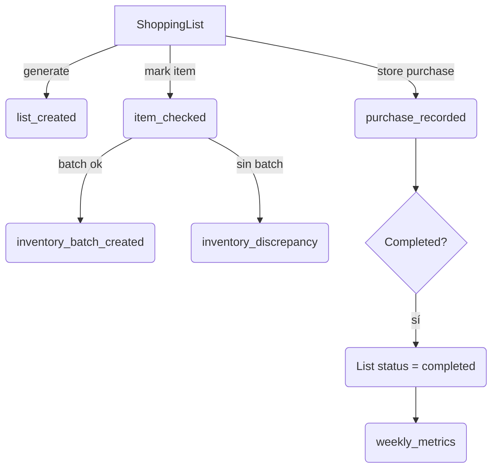

# Sogar

Aplicación Laravel para gestionar presupuestos, listas de compras e inventario familiar con enfoque en moneda COP y zona horaria Bogotá.

## Stack
- PHP 8.2 · Laravel 12 + Livewire/Volt
- MySQL / SQLite (pruebas)
- Tailwind + Vite para assets

## Runbook rápido
1. Instala dependencias
   ```bash
   composer install
   npm install
   ```
2. Configura el entorno (una vez)
   ```bash
   cp .env.example .env
   php artisan key:generate
   ```
3. Migra según el contexto
   ```bash
   # Dev/pruebas en SQLite
   php artisan migrate --database=sqlite

   # Normal (usa conexión por defecto)
   php artisan migrate
   ```
4. Genera assets
   ```bash
   npm run build # o npm run dev
   ```
5. Corre pruebas y jobs clave
   ```bash
   php artisan test
   php artisan shopping:metrics   # dispara el job semanal bajo demanda
   php artisan schedule:run       # ejecuta tareas programadas (incluye métricas)
   ```

## Observabilidad y métricas
- Todos los puntos críticos (creación de listas, check/uncheck, compras, lotes) quedan registrados en `sogar_shopping_list_events` mediante `ShoppingListEventLogger`.
- El job `App\Jobs\ComputeShoppingMetrics` se programa cada lunes 03:00 (America/Bogota) desde `App\Console\Kernel`. Usa `php artisan shopping:metrics {userId?}` para forzarlo.
- `inventory_discrepancy` se dispara cuando un ítem marcado no produce `inventory_batch_id`; la UI muestra badges y los eventos quedan disponibles para auditoría.
- La documentación extendida vive en [`docs/purchase-flow.md`](docs/purchase-flow.md).

## Diagrama del flujo principal


## Notas adicionales
- El metadata de `ShoppingListItem` almacena `added_to_inventory`, `inventory_batch_id` y `added_at` para sincronizar UI e inventario.
- Usa `php artisan tinker` para recalcular `actual_total` de una lista si detectas diferencias (ejemplo en la guía de compras).
- Las pruebas de autenticación dependen de SQLite; usa `php artisan test` antes de cada commit para asegurar compatibilidad multi-driver.
