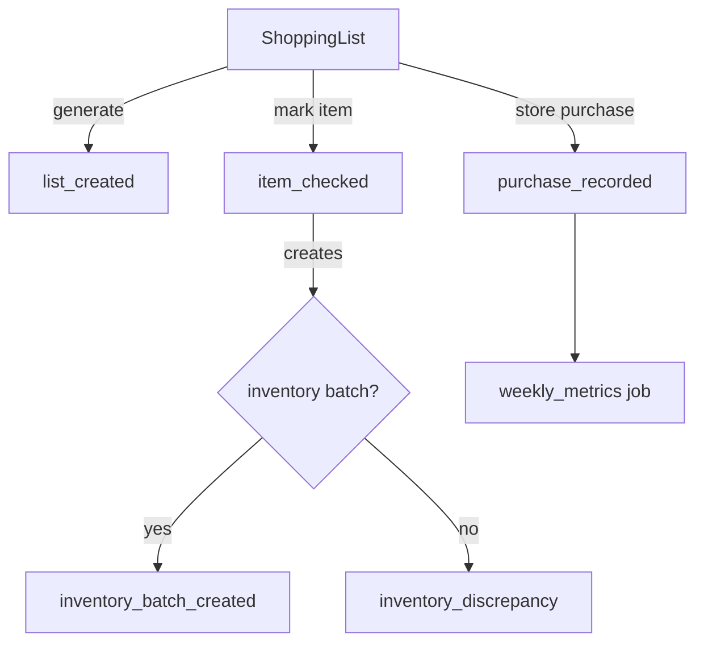

# Flujo lista → compra → inventario

Esta guía resume cómo se mueve la data desde la generación de una lista hasta que los lotes llegan al inventario y cómo auditar cada paso con los nuevos eventos.

## Panorama general
- **Generación**: `ShoppingListController@generate` crea la lista (manual o vía `ShoppingListGenerator`). Se registra un evento `list_created` con el presupuesto estimado y el tipo de lista.
- **Marcado de ítems**: `ShoppingListController@markItem` actualiza cantidades, precios reales y, si procede, crea un lote `FoodStockBatch`. Cada acción dispara `item_checked` y, cuando hay lote, `inventory_batch_created`.
- **Compras**: `PurchaseController@store` confirma la compra completa, recalcula totales, crea compras (`FoodPurchase`, `FoodPurchaseItem`) y vuelve a generar lotes para cada producto incluido. Se registran eventos `item_checked`, `inventory_batch_created` o `inventory_discrepancy`, además de `purchase_recorded`.
- **Alertas**: Cuando un ítem queda marcado como comprado pero no hay `inventory_batch_id`, se emite `inventory_discrepancy`. La UI lo consume para mostrar badges preventivos.
- **Métricas**: El job `ComputeShoppingMetrics` genera semanalmente `weekly_metrics` con totales diarios y brechas de inventario.

## Eventos clave
| Evento | Cuándo ocurre | Payload relevante |
| --- | --- | --- |
| `list_created` | Nueva lista activa | `list_type`, `budget_id`, `estimated_budget` |
| `item_checked` | Item marcado o actualizado | `item_id`, `is_checked`, `actual_price`, `cop_delta`, `source` |
| `inventory_batch_created` | Lote agregado al inventario | `batch_id`, `qty_base`, `cost_total`, `source` |
| `inventory_discrepancy` | Item sin lote después de marcarlo | `item_id`, `reason` |
| `purchase_recorded` | Compra almacenada | `purchase_id`, `total_cop`, `difference_cop`, `occurred_on`, `remaining_items` |
| `weekly_metrics` | Job semanal | `daily_totals`, `inventory_gap_base`, `pending_items`, `cop_total_checked` |

Todos los eventos incluyen `logged_at`, `timezone` (America/Bogota) y `currency` (COP) para auditoría consistente.

## Metadatos en `ShoppingListItem`
`metadata` guarda flags sincronizados entre listas, compras e inventario:

| Clave | Descripción |
| --- | --- |
| `added_to_inventory` | Booleano que indica si ya hubo intento de ingreso a inventario. |
| `added_at` | Fecha ISO8601 en Bogotá cuando se creó el lote. |
| `inventory_batch_id` | ID del `FoodStockBatch` asociado; base para badges en UI. |
| `expires_on` | Copiado del producto si existe vida útil. |

Tip: si `added_to_inventory = true` pero `inventory_batch_id` no existe, el job de métrica y la UI alzarán una alerta.

## Recalcular totales
1. Ejecuta `php artisan tinker`.
2. Corre:
   ```php
   $list = App\Models\ShoppingList::with('items')->find($id);
   $list->actual_total = $list->items->sum(fn ($item) => $item->is_checked ? ($item->actual_price ?? $item->estimated_price ?? 0) : 0);
   $list->save();
   ```
3. Verifica los eventos `purchase_recorded` recientes para validar la diferencia esperada vs real (`cop_delta`).

## Limpiar duplicados / inconsistencias
- Encuentra ítems sospechosos:
  ```sql
  select id, name from sogar_shopping_list_items where metadata ->> '$.inventory_batch_id' is null and is_checked = 1;
  ```
- Usa `inventory_discrepancy` para conocer la causa (`missing_product`, `pending_batch`, `batch_not_created`).
- Para recrear el lote manualmente puedes llamar `ShoppingListController@markItem` nuevamente con `is_checked=true` o crear un `FoodStockBatch` y actualizar el metadata.

## Métricas semanales
- El job `ComputeShoppingMetrics` corre cada lunes 03:00 (Bogotá) desde `App\Console\Kernel`.
- Ejecuta manualmente con `php artisan shopping:metrics` (opcionalmente pasa un `userId`).
- Cada snapshot `weekly_metrics` agrega:
  - `daily_totals`: totales COP e items por día (últimos 7 días).
  - `inventory_gap_base`: suma de cantidades aún no cubiertas.
  - `pending_items`: conteo de ítems sin marcar.

## Diagrama del flujo


Esta documentación se complementa con el runbook del `README.md`. Usa ambos para entender dónde añadir nuevas validaciones o integrar paneles de observabilidad.
